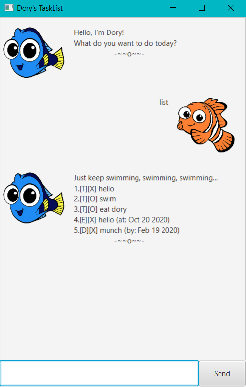

# User Guide
## Introduction
Dory's TaskList is a program that helps you keep track of your tasks. 

## Preview



## Features 
### 1. Keeps track of tasks
Lists the tasks currently present in the task list.

### 2. Conveniently updates task list
The tasks in the task list can be easily added, removed and changed.
The tasks you have listed can be searched.

## Add a Task
### 1. To do
Adds a to do task which has a description and no deadline.

Command: `todo DESCRIPTION` 

For example, if the user types `todo art homework`,

The expected outcome would be: 
```
I will try to remember it:
[T][X] art homework
Now you have 4 tasks in the list.
```

### 2. Event
Adds an event task that describes an event that would occur at a certain date.

Command: `event DESCRIPTION YYYY-MM-DD`

For example, if the user types `event meet nemo /at 2020-02-19`,

The expected outcome would be:
 ```
 I will try to remember it:
 [E][X] meet nemo (at: Feb 19 2020)
 Now you have 5 tasks in the list.
 ```

### 3. Deadline
Adds an deadline task that describes an event which has a deadline that it needs to be done by.

Command: `deadline DESCRIPTION YYYY-MM-DD`

For example, if the user types `deadline search for nemo /by 2021-01-01`

The expected outcome would be:
 ```
 I will try to remember it:
 [D][X] search for nemo (by: Jan 1 2021)
 Now you have 6 tasks in the list.
 ```

## Commands
### 1. List tasks
A list of the tasks in the task list will be printed.

Command: `list`

An example would be: 
```
Just keep swimming, swimming, swimming...
1.[T][X] go for classes
2.[T][O] swim
3.[D][X] complete assignment (by: Feb 19 2020)
4.[E][X] presentation (at: Jan 1 2020)
```

### 2. Delete a task
Deletes the task at the specified index.

Command: `delete INDEX`

For example, if the user enters `delete 2`, 

The expected outcome is:
```
I've removed it:
[T][O] swim
Now you have 3 tasks in the list.
```
Expected outcome: 
`Task number 3 is deleted.`

### 3. Mark a task as done
Marks the task at the specified index as done.

Command: `done INDEX`

For example, if the user enters `done 2`,

The expected outcome is:
```
Great job! I've marked it as done:
[D][O] complete assignment (by: Feb 19 2020)
```

### 4. Search for tasks
Lists the tasks that contain the specified keyword.

Command: `find KEYWORD`

For example, if the user enters `find class`,

The expected outcome is:
```
Here's what I've found amongst all the marine litter:
1.[T][X] go for classes
```


### 5. Update task description
Updates the message of the task at the specified index.

Command: `updatem INDEX MESSAGE` 

For example, if the user enters `updatem 1 go for math classes`,

The expected outcome is:
```
I have updated it:
[T][X] go for math classes
```

### 6. Update task date
Updates the date of a event or deadline task at the specified index.

Command: `updated INDEX YYYY-MM-DD`

For example, if the user enters `updated 3 2020-05-02`,

The expected outcome is: 
```
I have updated it:
[E][X] presentation (at: May 2 2020)
```